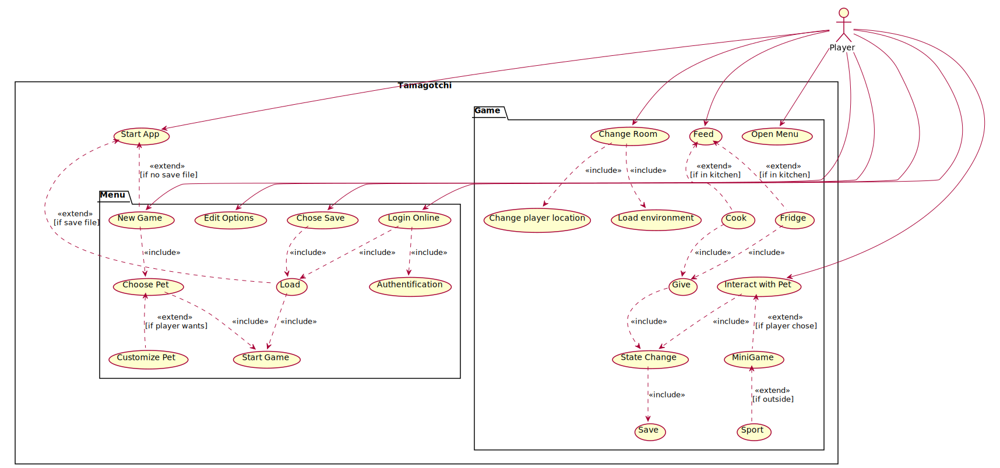

# Tamagotchi
Projet étudiant dans lequel on doit réaliser un jeu tamagotchi ; autrement dit, un jeu d'animaux de compagnie virtuel.

# Import du projet Git avec Eclipse

## 1 NOTE
**Pour de meilleur explications voir directement [la doc javafx](https://openjfx.io/openjfx-docs/#IDE-Eclipse) **
**[Wiki](https://fr.wikipedia.org/wiki/Markdown) à propos du readme.md (md pour MarkDown)**

### JavaFX
1. Il faut télécharger JavaFX ([openjfx.io](https://openjfx.io/#fh5co-intro)) ou l'installer via votre distribution linux  
`sudo apt install openjfx`

## 2 Import du projet
1. Aller dans **File -> import -> Git -> projects from Git -> Clone URI**
2. Entrer l'url du projet git
3. Entrer vos identifiants github
4. Next -> **master/main branch (check) -> Location : YOUR_WORKSPACE_LOCATION -> Import using the new Project wizard -> Java -> Java Project** 
5. Le nom du projet doit être le même que le repository, donc **Tamagotchi**.

### 1 Configuration project

#### après l'import
Dans eclipse -> **project -> properties -> java build path -> Classpath (click)**

#### pendant l'import
Dans l'onglet -> **Libraries -> Classpath (click)**

### suivi de
1. **Add Library -> User Library -> User Libraries -> New** 
2. une fenêtre s'affiche, au champ `User library name` entrer le nom de la lib (ex: javafx).
3. **selectionner la nouvelle lib -> Add External JARs -> **`chemin/vers/javafx-sdk/lib`** -> sellectioner tous les .jar-> Open**
4. **cocher la nouvelle lib -> Finish**

### 2 Configuration run
1. **Dans Run -> Run configuration -> java application (double clique)** -> Entrer les champs: 

- Name : NOM_RUN
- Projcet name : Tamagotchi
- Main class : test.Test

2. Allez dans l'onglet -> **Arguments -> VM Arguments**  
`--module-path /chemin/du/repertoire/java-xx-openjfx/lib --add-modules javafx.controls`
3. Allez dans l'onglet -> **Common -> Display in favorites menus -> selectionner Run**
5. Lancer le programme avec NOM_RUN
